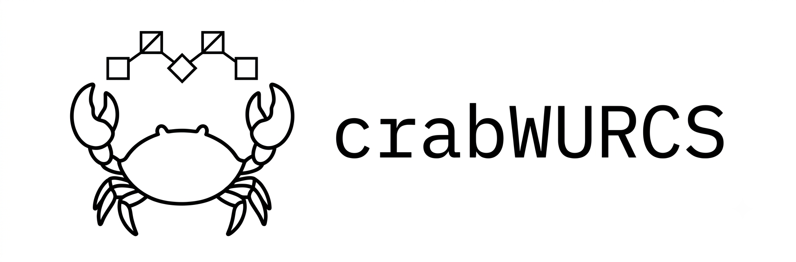

# crabWURCS

[](https://github.com/Ojas-Singh/crabWURCS/actions/workflows/ci.yml)
[](https://pypi.org/project/crabwurcs/)
[](https://crates.io/crates/crabwurcs)
[](https://docs.rs/crabwurcs)
[](LICENSE-MIT)

crabWURCS is a pure-Rust glycoinformatics toolkit with first-class Python and
command-line interfaces. It converts WURCS 2.0, IUPAC condensed/extended,
GLYCAM, SMILES, MOL, and SDF; extracts glycans from PDB/mmCIF; and renders SNFG
SVG or PNG images.

## Install

Python 3.9 or newer:

```bash
pip install crabwurcs
```

Rust library or CLI:

```bash
cargo add crabwurcs@0.3.0
cargo install crabwurcs-cli@0.3.0
```

Prebuilt Python wheels use the stable CPython ABI and do not require RDKit or
a local Rust compiler on supported Linux, macOS, and Windows systems.

## Python quick start

```python
import crabwurcs

glycan = crabwurcs.Glycan.parse("Gal(b1-4)GlcNAc")
print(glycan.to(crabwurcs.Format.WURCS))
print(glycan.to(crabwurcs.Format.SMILES))

svg = glycan.render(
    "svg",
    highlight_motifs=["Gal(b1-?)GlcNAc"],
)
open("glycan.svg", "w").write(svg)

for result in crabwurcs.extract_pdb_file("structure.cif"):
    print(result.attachment_site, result.glycan.to("iupac-condensed"))
    print(result.residues)
```

Convenience functions are available for one-step use:

```python
wurcs = crabwurcs.convert(
    "Gal(b1-4)GlcNAc",
    to_format="wurcs",
    from_format="iupac-condensed",
)
png = crabwurcs.render_snfg(wurcs, from_format="wurcs", image_format="png")
```

## Rust quick start

```rust
use crabwurcs::{Format, convert, parse_notation, render_svg};

fn main() -> Result<(), Box<dyn std::error::Error>> {
    let iupac = "Gal(b1-4)GlcNAc";
    let wurcs = convert(iupac, Format::IupacCondensed, Format::Wurcs)?;
    let graph = parse_notation(&wurcs, Format::Wurcs)?;
    let svg = render_svg(&graph)?;
    println!("{svg}");
    Ok(())
}
```

## Command line

Both `pip install crabwurcs` and `cargo install crabwurcs-cli` install the
`crabwurcs` command:

```bash
crabwurcs convert --to wurcs 'Gal(b1-4)GlcNAc'
crabwurcs wurcs-to-mol --format smiles glycan.wurcs
crabwurcs pdb-to-wurcs --to iupac-condensed structure.cif
crabwurcs render --output glycan.png 'Gal(b1-4)GlcNAc'
```

## Coverage and chemical guarantees

- All 87 SNFG 2.0.4 registry entries parse and render.
- All 74 chemically concrete entries are tested through WURCS, IUPAC,
  SMILES, MOL/SDF, and PDB/mmCIF component recognition.
- The 13 generic/display-only classes preserve uncertainty and return typed
  errors when a concrete molecule would require invented stereochemistry.
- Compositions, uncertain linkage ensembles, probabilities, and variable
  repeats do not silently collapse to one molecule.
- PDB/mmCIF extraction retains chain, sequence number, insertion code, and
  graph-node provenance. Coordinate generation and PDB writing are out of
  scope for 0.3.0.

See the [complete residue table](https://github.com/Ojas-Singh/crabWURCS/blob/main/crabwurcs/docs/supported-monosaccharides.md)
and [format limitations](https://ojas-singh.github.io/crabWURCS/formats/) for details.

## Workspace

```text
crabwurcs-core    WURCS grammar and shared ResidueGraph
crabwurcs-iupac   IUPAC condensed/extended and GLYCAM
crabwurcs-mol     SMILES, MOL, and SDF molecular interop
crabwurcs-pdb     PDB/mmCIF glycan extraction
crabwurcs-snfg    SNFG SVG/PNG rendering
crabwurcs         unified Rust facade
crabwurcs-cli     Rust command-line application
crabwurcs-python  private PyO3 extension for the PyPI package
```

## Documentation and development

- [User guide](https://ojas-singh.github.io/crabWURCS/)
- [Rust API](https://docs.rs/crabwurcs)
- [Python API](site-docs/python-api.md)
- [Contributing](CONTRIBUTING.md)
- [Release process](RELEASE.md)
- [Changelog](CHANGELOG.md)

crabWURCS is available under the [MIT license](LICENSE-MIT).
