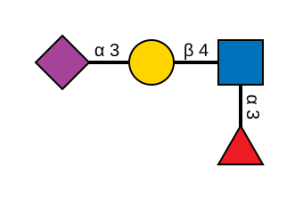
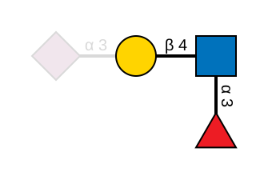

# Motif highlighting

[`render_svg_with_motifs`] de-emphasises every residue outside a motif of
interest, so a specific substructure stands out against the rest of the glycan.
This is the same GlycoDraw-compatible look used by the `crabwurcs render
--highlight-motif` CLI flag.

[`render_svg_with_motifs`]: https://docs.rs/crabwurcs-snfg/latest/crabwurcs_snfg/fn.render_svg_with_motifs.html

## At a glance

Target: `Neu5Ac(a2-3)Gal(b1-4)[Fuc(a1-3)]GlcNAc`. Highlighted motif:
`Gal(b1-4)[Fuc(a1-3)]GlcNAc`.

| Without highlight | With motif highlighted |
|---|---|
|  |  |

Matched residues and the motif-internal bonds keep their full SNFG colour; the
non-matching `Neu5Ac` branch and its bond drop to the muted palette below.

## How matching works

Matching is structural and wildcard-aware, implemented by
[`find_motif_matches`]. The motif is an ordinary [`ResidueGraph`] parsed from
WURCS, IUPAC (condensed or extended), or GLYCAM.

[`find_motif_matches`]: https://docs.rs/crabwurcs-core/latest/crabwurcs_core/fn.find_motif_matches.html
[`ResidueGraph`]: https://docs.rs/crabwurcs-core/latest/crabwurcs_core/struct.ResidueGraph.html

- **Injective, directed, non-induced.** Each motif node maps to one target
  node; extra branches and extra residue modifications on the target are
  allowed and do not block a match.
- **Unknown anomers and positions are wildcards.** `Fuc(a1-?)GlcNAc` matches
  `Fuc(a1-3)GlcNAc`, `Fuc(a1-4)GlcNAc`, etc.
- **Generic classes match their whole family.** A motif residue `Hex` matches
  `Glc`, `Man`, `Gal`, and every other hexose; `HexNAc` matches every
  N-acetylhexosamine; `Sia` matches `Neu5Ac`, `Neu5Gc`, `Kdn`, `Neu`. This
  follows `ResidueKind::matches_family`, so a single generic motif captures
  every stereochemical variant in its row of the SNFG table.
- **Union over motifs and occurrences.** Every occurrence of every supplied
  motif is highlighted; passing several motifs builds up the union of their
  matches. An empty motif list is identical to a plain render.

Boundary edges — the bonds between a matched region and the rest of the target
— are treated as outside the motif and dimmed with their target-side residue.

## The muted palette

Dimmed residues stay fully opaque (they must occlude the bonds drawn behind
them) but drop to desaturated versions of the SNFG colours:

| SNFG colour | Muted |
|---|---|
| Blue `#0072BC` | `#CDE7EF` |
| Green `#00A651` | `#CDE9DF` |
| Yellow `#FFD400` | `#FFF6DE` |
| Orange `#F47920` | `#FDE7E0` |
| Pink `#F69EA1` | `#FDF0F1` |
| Purple `#A54399` | `#F1E6ED` |
| Light blue `#8FCCE9` | `#EEF8FB` |
| Brown `#A17A4D` | `#F1E9E5` |
| Red `#ED1C24` | `#F7E0E0` |

Bonds and text outside a match draw in light grey `#D9D9D9`.

## Usage

```rust,ignore
use crabwurcs::{render_svg_with_motifs, RenderOptions};

let target = crabwurcs::iupac::parse_iupac_condensed(
    "Neu5Ac(a2-3)Gal(b1-4)[Fuc(a1-3)]GlcNAc",
).unwrap();

// Wildcard linkage position — matches α3 or α4 fucose.
let motif = crabwurcs::iupac::parse_iupac_condensed("Gal(b1-4)[Fuc(a1-?)]GlcNAc").unwrap();

let svg = render_svg_with_motifs(&target, &[motif], &RenderOptions::default()).unwrap();
```

Repeat the call with several motifs to highlight a union of substructures.
PNG output is available through [`render_png_with_motifs`].

[`render_png_with_motifs`]: https://docs.rs/crabwurcs-snfg/latest/crabwurcs_snfg/fn.render_png_with_motifs.html

## Motif constraints

A motif must describe a connected, directed tree of known residues. The matcher
returns [`MotifError`] otherwise:

[`MotifError`]: https://docs.rs/crabwurcs-core/latest/crabwurcs_core/enum.MotifError.html

| Variant | Meaning |
|---|---|
| `Empty` | The motif graph has no residues. |
| `Composition` | Compositions cannot be used as motifs. |
| `Disconnected` | The motif is not a single connected graph. |
| `NotTree` | The motif is not a directed tree rooted at its reducing end. |
| `CycleOrRepeat` | The motif contains a cycle or a repeat-closing edge. |
| `UndefinedLinkage` | The motif contains an undefined (candidate-parent) linkage. |
| `UndefinedModification` | The motif contains an undefined (candidate-parent) modification. |
