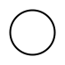
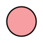
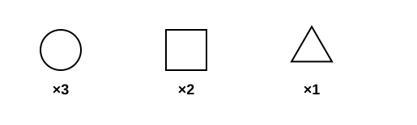

# SNFG rendering

[`render_svg`] and friends turn a [`ResidueGraph`] into an SNFG (Symbol
Nomenclature for Glycans) figure. The output follows SNFG 2.0.4: shape encodes
the chemical class, colour encodes the stereochemical family, and the layout
places the reducing end on the right with children extending to the left.

[`render_svg`]: https://docs.rs/crabwurcs-snfg/latest/crabwurcs_snfg/fn.render_svg.html
[`ResidueGraph`]: https://docs.rs/crabwurcs-core/latest/crabwurcs_core/struct.ResidueGraph.html

## Shapes

Each monosaccharide family maps to a distinct geometric primitive. The gallery
below shows one representative per shape; see
[Supported monosaccharides](supported-monosaccharides.md) for the full table.

| Shape | Family | Example |
|---|---|---|
| Circle | Hexoses |  |
| Square | N-Acetylhexosamines |  |
| Notched square | Hexosamines (amino, non-acetylated) |  |
| Divided diamond (top) | Hexuronates |  |
| Divided diamond (bottom) | Iduronic acid |  |
| Triangle | 6-Deoxyhexoses |  |
| Divided triangle | 6-Deoxyhexosamines |  |
| Flat rectangle | 2,6-Dideoxyhexoses |  |
| Star | Pentoses |  |
| Diamond | Nonulosonic acids (sialic acids) |  |
| Flat diamond | 3,9-Dideoxy-nonulosonic acids |  |
| Flat hexagon | Unknown / bacterial / muramic acid family |  |
| Pentagon | Assigned & ketoses |  |

## Colour palette

The official SNFG RGB palette. Generic classes (unspecified stereochemistry)
draw in white while keeping their family shape.

| Name | Hex | Swatch |
|---|---|---|
| White | `#FFFFFF` |  |
| Blue | `#0072BC` |  |
| Green | `#00A651` |  |
| Yellow | `#FFD400` |  |
| Orange | `#F47920` |  |
| Pink | `#F69EA1` |  |
| Purple | `#A54399` |  |
| Light blue | `#8FCCE9` |  |
| Brown | `#A17A4D` |  |
| Red | `#ED1C24` |  |

Family → colour assignment follows the standard mapping: Glc blue, Gal yellow,
Man green, Fuc red, sialic acids purple/light-blue, iduronic brown, and so on.
Generic classes (e.g. `Hex`, `HexNAc`) keep the family shape but fill white.

## Layout

The renderer lays the glycan out as a rooted tree:

- **Root on the right.** The reducing-end residue sits at the right edge of the
  canvas; every child extends one step (100 px) to the left.
- **Post-order vertical packing.** A parent is centred vertically between its
  children; leaf residues are stacked at 100 px vertical spacing.
- **Branch order follows the acceptor position.** Higher acceptor positions sit
  above lower ones — for example the N-glycan α1-6 arm is drawn above α1-3, and
  β1-4 above β1-2.
- **Terminal deoxy-sugar lanes.** Terminal fucose and rhamnose residues are
  drawn vertically aligned with their parent. When a parent carries both a
  α1-3 and α1-6 fucose (or α1-2 and α1-4 rhamnose), they are split above and
  below the parent instead of overlapping; a single such branch and the core
  α6-fucose default to one side so no residue is overprinted.
- **Disconnected components** (compositions, undefined antennae) are all laid
  out rather than silently dropped.

Linkage labels (`α3`, `β4`, etc.) are placed beside each bond, rotated to the
bond angle. Repeat/cyclic and undefined bonds draw as dashed grey lines; an
unknown position renders as `?`.

## Composition layout

WURCS compositions (a multiset of residues with no linkage information) render
as a single row of grouped symbols, each with a `×N` count.



## Render options

[`RenderOptions`] controls the figure:

[`RenderOptions`]: https://docs.rs/crabwurcs-snfg/latest/crabwurcs_snfg/struct.RenderOptions.html

| Field | Default | Effect |
|---|---|---|
| `colour` | `true` | Fill shapes with the SNFG palette; `false` draws outlines only. |
| `show_labels` | `false` | Draw residue abbreviations inside shapes. Off by default — SNFG convention is that shape + colour is the label. |
| `show_linkages` | `true` | Draw anomeric and position labels on each bond. |
| `font_family` | `Arial, Helvetica, sans-serif` | Font stack for all text. |
| `scale` | `1.0` | Uniform scale of the whole figure. |
| `source_notation` | `None` | Records the exact input notation in the SVG metadata. |

`Assigned` pentagons always show their first-letter label regardless of
`show_labels`, because their identity is not recoverable from shape or colour.

## Output formats

- **SVG** — [`render_svg`] / [`render_svg_with_options`]. Vector output,
  transparent background, embeds accessible `<title>`/`<desc>` and a
  `<metadata>` block carrying the canonical IUPAC condensed and WURCS notation.
- **PNG** — [`render_png`] / [`render_png_with_options`]. Transparent RGBA
  raster at twice the SVG dimensions.

[`render_svg_with_options`]: https://docs.rs/crabwurcs-snfg/latest/crabwurcs_snfg/fn.render_svg_with_options.html
[`render_png`]: https://docs.rs/crabwurcs-snfg/latest/crabwurcs_snfg/fn.render_png.html
[`render_png_with_options`]: https://docs.rs/crabwurcs-snfg/latest/crabwurcs_snfg/fn.render_png_with_options.html

```rust,ignore
use crabwurcs::{render_svg_with_options, render_png, RenderOptions};

let graph = crabwurcs::iupac::parse_iupac_condensed("Gal(b1-4)GlcNAc").unwrap();

let svg = render_svg_with_options(&graph, &RenderOptions::default()).unwrap();
let png = render_png(&graph).unwrap(); // transparent 2× RGBA
```

## Embedded metadata

Every SVG carries an invisible `<metadata>` block (`crabwurcs:notations`) with:

- the canonical IUPAC condensed form,
- the canonical WURCS form, and
- the original source notation and detected format (when available).

Each field is marked `available="true|false"` so a downstream tool knows when a
canonical form could not be produced (for example an `Assigned` residue that
cannot be represented in WURCS) without failing the render.
