# Supported monosaccharides

crabWURCS renders the complete SNFG 2.0.4 symbol table. Every residue resolves
to a **shape + colour** pair — together they encode the monosaccharide identity
following the official Symbol Nomenclature for Glycans (the symbol alone is the
label; residue abbreviations are optional).

The 87 entries below are the authoritative list returned by
[`ResidueKind::ALL`][all]. Generic classes (marked **generic**) preserve
unspecified stereochemistry: they keep their family colour but draw in white,
match any member of their family in motif queries, and cannot be exported to
GLYCAM (which would require assigning stereochemistry that is not present).

Each symbol image on this page is generated by [`render_symbol_svg`] from the
same renderer that draws full glycan figures, so the legend can never drift from
the library's actual output.

[all]: https://docs.rs/crabwurcs-core/latest/crabwurcs_core/enum.ResidueKind.html
[`render_symbol_svg`]: https://docs.rs/crabwurcs-snfg/latest/crabwurcs_snfg/fn.render_symbol_svg.html

## Hexoses — circle

| Symbol | Name | WURCS UniqueRES | Aliases | Generic |
|---|---|---|---|---|
|  | `Hex` | `axxxxh-1x_1-5` | Hexose | ✓ |
|  | `Glc` | `a2122h-1x_1-5` | Glucose | |
|  | `Man` | `a1122h-1x_1-5` | Mannose | |
|  | `Gal` | `a2112h-1x_1-5` | Galactose | |
|  | `Gul` | `a2212h-1x_1-5` | Gulose | |
|  | `Alt` | `a1222h-1x_1-5` | Altrose | |
|  | `All` | `a1111h-1x_1-5` | Allose | |
|  | `Tal` | `a1112h-1x_1-5` | Talose | |
| 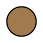 | `Ido` | `a2121h-1x_1-5` | Idose | |

## N-Acetylhexosamines — square

| Symbol | Name | WURCS UniqueRES | Aliases | Generic |
|---|---|---|---|---|
|  | `HexNAc` | `axxxxh-1x_1-5_2*NCC/3=O` | N-Acetylhexosamine | ✓ |
|  | `GlcNAc` | `a2122h-1x_1-5_2*NCC/3=O` | N-Acetylglucosamine | |
|  | `ManNAc` | `a1122h-1x_1-5_2*NCC/3=O` | N-Acetylmannosamine | |
|  | `GalNAc` | `a2112h-1x_1-5_2*NCC/3=O` | N-Acetylgalactosamine | |
|  | `GulNAc` | `a2212h-1x_1-5_2*NCC/3=O` | N-Acetylgulosamine | |
|  | `AltNAc` | `a1222h-1x_1-5_2*NCC/3=O` | N-Acetylaltrosamine | |
|  | `AllNAc` | `a1111h-1x_1-5_2*NCC/3=O` | N-Acetylallosamine | |
|  | `TalNAc` | `a1112h-1x_1-5_2*NCC/3=O` | N-Acetyltalosamine | |
| 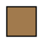 | `IdoNAc` | `a2121h-1x_1-5_2*NCC/3=O` | N-Acetylidosamine | |

## Hexosamines — notched square

A white square with a coloured corner triangle indicates an amino (non-acetylated)
sugar.

| Symbol | Name | WURCS UniqueRES | Aliases | Generic |
|---|---|---|---|---|
| 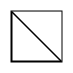 | `HexN` | `axxxxh-1x_1-5_2*N` | Hexosamine | ✓ |
|  | `GlcN` | `a2122h-1x_1-5_2*N` | Glucosamine | |
|  | `ManN` | `a1122h-1x_1-5_2*N` | Mannosamine | |
| 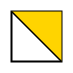 | `GalN` | `a2112h-1x_1-5_2*N` | Galactosamine | |
|  | `GulN` | `a2212h-1x_1-5_2*N` | Gulosamine | |
| 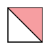 | `AltN` | `a1222h-1x_1-5_2*N` | Altrosamine | |
|  | `AllN` | `a1111h-1x_1-5_2*N` | Allosamine | |
|  | `TalN` | `a1112h-1x_1-5_2*N` | Talosamine | |
| 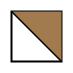 | `IdoN` | `a2121h-1x_1-5_2*N` | Idosamine | |

## Hexuronates — divided diamond

The coloured half of the diamond denotes a uronic acid. Most uronates colour the
top half; **IdoA** is drawn with the bottom half coloured (brown), matching the
official table.

| Symbol | Name | WURCS UniqueRES | Aliases | Generic |
|---|---|---|---|---|
|  | `HexA` | `axxxxA-1x_1-5` | Hexuronate, HexuronicAcid | ✓ |
|  | `GlcA` | `a2122A-1x_1-5` | GlucuronicAcid | |
|  | `ManA` | `a1122A-1x_1-5` | MannuronicAcid | |
| 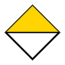 | `GalA` | `a2112A-1x_1-5` | GalacturonicAcid | |
|  | `GulA` | `a2212A-1x_1-5` | GuluronicAcid | |
| 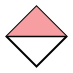 | `AltA` | `a1222A-1x_1-5` | AltruronicAcid | |
|  | `AllA` | `a1111A-1x_1-5` | AlluronicAcid | |
|  | `TalA` | `a1112A-1x_1-5` | TaluronicAcid | |
|  | `IdoA` | `a2121A-1x_1-5` | IduronicAcid | |

## 6-Deoxyhexoses — triangle

| Symbol | Name | WURCS UniqueRES | Aliases | Generic |
|---|---|---|---|---|
| 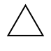 | `dHex` | `axxxxm-1x_1-5` | Deoxyhexose | ✓ |
|  | `Qui` | `a2122m-1x_1-5` | Quinovose | |
|  | `Rha` | `a2211m-1x_1-5` | Rhamnose | |
|  | `6dGul` | `a2212m-1x_1-5` | 6-DeoxyGulose | |
| 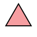 | `6dAlt` | `a2111m-1x_1-5` | 6-DeoxyAltrose | |
| 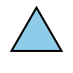 | `6dTal` | `a1112m-1x_1-5` | 6-DeoxyTalose | |
|  | `Fuc` | `a1221m-1x_1-5` | Fucose | |

## 6-Deoxyhexosamines — divided triangle

| Symbol | Name | WURCS UniqueRES | Aliases | Generic |
|---|---|---|---|---|
|  | `dHexNAc` | `axxxxm-1x_1-5_2*NCC/3=O` | DeoxyhexNAc | ✓ |
|  | `QuiNAc` | `a2122m-1x_1-5_2*NCC/3=O` | N-Acetylquinovosamine | |
|  | `RhaNAc` | `a2211m-1x_1-5_2*NCC/3=O` | N-Acetylrhamnosamine | |
| 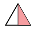 | `6dAltNAc` | `a2111m-1x_1-5_2*NCC/3=O` | N-Acetyl6-DeoxyAltrosamine | |
|  | `6dTalNAc` | `a1112m-1x_1-5_2*NCC/3=O` | N-Acetyl6-DeoxyTalosamine | |
|  | `FucNAc` | `a1221m-1x_1-5_2*NCC/3=O` | N-Acetylfucosamine | |

## 2,6-Dideoxyhexoses — flat rectangle

| Symbol | Name | WURCS UniqueRES | Aliases | Generic |
|---|---|---|---|---|
|  | `ddHex` | `adxxxm-1x_1-5` | Di-deoxyhexose, Dideoxyhexose | ✓ |
|  | `Oli` | `ad122m-1x_1-5` | Olivose | |
|  | `Tyv` | `a1d22m-1x_1-5` | Tyvelose | |
|  | `Abe` | `a2d12m-1x_1-5` | Abequose | |
|  | `Par` | `a2d22m-1x_1-5` | Paratose | |
|  | `Dig` | `ad222m-1x_1-5` | Digitoxose | |
|  | `Col` | `a1d21m-1x_1-5` | Colitose | |

## Pentoses — star

| Symbol | Name | WURCS UniqueRES | Aliases | Generic |
|---|---|---|---|---|
|  | `Pen` | `axxxh-1x_1-5` | Pentose | ✓ |
|  | `Ara` | `a211h-1x_1-5` | Arabinose | |
|  | `Lyx` | `a112h-1x_1-5` | Lyxose | |
|  | `Xyl` | `a212h-1x_1-5` | Xylose | |
|  | `Rib` | `a222h-1x_1-5` | Ribose | |

## Nonulosonic acids (sialic acids) — diamond

| Symbol | Name | WURCS UniqueRES | Aliases | Generic |
|---|---|---|---|---|
|  | `NulO` | `Aadxxxxxh-2x_2-6` | 3-deoxy-nonulosonicAcid, Nonulosonate | ✓ |
|  | `Kdn` | `Aad21122h-2x_2-6` | KDN | |
|  | `Neu5Ac` | `Aad21122h-2x_2-6_5*NCC/3=O` | NeuAc, Neup5Ac | |
|  | `Neu5Gc` | `Aad21122h-2x_2-6_5*NCCO/3=O` | NeuGc, Neup5Gc | |
|  | `Neu` | `Aad21122h-2x_2-6_5*N` | NeuraminicAcid | |
|  | `Sia` | _(no UniqueRES — display class only)_ | SialicAcid | ✓ |

## 3,9-Dideoxy-nonulosonic acids — flat diamond

| Symbol | Name | WURCS UniqueRES | Aliases | Generic |
|---|---|---|---|---|
|  | `ddNulO` | `Aadxxxxxm-2x_2-6_5*N_7*N` | 3,9-dideoxy-nonulosonicAcid | ✓ |
|  | `Pse` | `Aad22111m-2x_2-6_5*N_7*N` | PseudaminicAcid | |
|  | `Leg` | `Aad21122m-2x_2-6_5*N_7*N` | LegionaminicAcid | |
|  | `Aci` | `Aad21111m-2x_2-6_5*N_7*N` | AcinetaminicAcid | |
|  | `4eLeg` | `Aad11122m-2x_2-6_5*N_7*N` | 4-epi-Leg | |

## Unknown & bacterial — flat hexagon

| Symbol | Name | WURCS UniqueRES | Aliases | Generic |
|---|---|---|---|---|
|  | `Unknown` | _(no UniqueRES — display class only)_ | UnknownSaccharide | ✓ |
|  | `Bac` | `a2122m-1x_1-5_2*N_4*N` | Bacillosamine | |
|  | `LDmanHep` | `a11221h-1x_1-5` | L-glycero-D-manno-Heptose | |
|  | `Kdo` | `Aad1122h-2x_2-6` | KDO | |
|  | `Dha` | `Aad112A-2x_2-6` | | |
|  | `DDmanHep` | `a11222h-1x_1-5` | D-glycero-D-manno-Heptose | |
|  | `MurNAc` | `a2122h-1x_1-5_2*NCC/3=O_3*OC^RCO/4=O/3C` | | |
|  | `MurNGc` | `a2122h-1x_1-5_2*NCCO/3=O_3*OC^RCO/4=O/3C` | | |
|  | `Mur` | `a2122h-1x_1-5_2*N_3*OC^RCO/4=O/3C` | MuramicAcid | |

## Assigned & ketoses — pentagon

The white `Assigned` pentagon stands in for any user-named residue whose
chemistry is not in the registry; its in-shape label is the uppercased first
letter of the assigned name. The remaining pentagons are ketoses.

| Symbol | Name | WURCS UniqueRES | Aliases | Generic |
|---|---|---|---|---|
|  | `Assigned` | _(no UniqueRES — display class only)_ | | ✓ |
|  | `Api` | `a15h-1x_1-4_3*CO` | Apiose | |
|  | `Fru` | `ha122h-2x_2-6` | Fructose | |
|  | `Tag` | `ha112h-2x_2-6` | Tagatose | |
|  | `Sor` | `ha121h-2x_2-6` | Sorbose | |
|  | `Psi` | `ha222h-2x_2-6` | Psicose | |

## Programmatic access

Resolve a residue's symbol at runtime with [`classify_residue`] and
[`render_symbol_svg`]:

```rust,ignore
use crabwurcs::{RenderOptions, render_symbol_svg, residue_from_kind, ResidueKind};

let residue = residue_from_kind(ResidueKind::Glc).unwrap();
let svg = render_symbol_svg(&residue, &RenderOptions::default()).unwrap();
assert!(svg.contains("fill=\"#0072BC\"")); // official SNFG blue
```

Residues that arrive from a parsed notation (not the registry) are classified
automatically — `render_svg` calls the same classifier, so any WURCS or IUPAC
input resolves to the correct symbol without an explicit `ResidueKind`.
